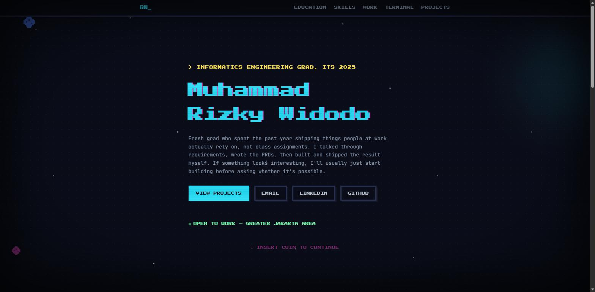

# Muhammad Rizky Widodo — Portfolio

A personal portfolio with a pixel/CRT terminal aesthetic. No templates, no drag-and-drop builder — every animation and interaction is hand-coded.

**Live:** https://rizkywidodo.github.io/Portfolio/



## Highlights

- Interactive Space Invaders hero (steer with mouse, playable, live score/high score)
- A working terminal you can actually type commands into
- Horizontally scrolling skills marquee
- Full case studies for production apps built during my internship at MRT Jakarta

## Stack

React 19 · TypeScript · Vite · Tailwind CSS 4 · React Router

## Run locally

```bash
npm install
npm run dev
```

Deploys to GitHub Pages on push to `main` via GitHub Actions.

## Contact

[Email](mailto:mrizkywidodo@gmail.com) · [LinkedIn](https://linkedin.com/in/muhammad-rizky-widodo)
